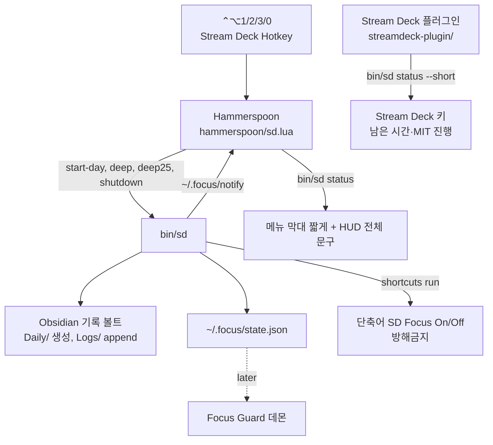

# Architecture

## System Overview

macOS 앱 계층은 Hammerspoon 하나다(adr/004). 단축키·메뉴 막대·HUD·알림을 맡고, 로직은 전부 `bin/sd`에 있다. 단축어는 집중 모드 on/off 두 개뿐이고 `bin/sd`가 부른다.



## Tech Stack

| Layer | Choice | ADR |
|-------|--------|-----|
| 앱 계층 | Hammerspoon (`hammerspoon/sd.lua`): 단축키, 메뉴 막대, HUD, 알림 | adr/004-hammerspoon-single-app |
| 트리거 | Hammerspoon 단축키 ⌃⌥1/2/3/0, Stream Deck은 Hotkey 액션으로 같은 키 | adr/004-hammerspoon-single-app |
| 집중 모드 | 단축어 `SD Focus On`/`SD Focus Off` (`bin/sd`가 `shortcuts run`) | adr/004-hammerspoon-single-app |
| 기록 | Obsidian 기록 볼트 (`~/workspace/personal/record-vault`), 코어 Daily Notes·Templates. 플러그인 없음 | — |
| 상태 | `~/.focus/state.json` | — |
| 스크립트 | `bin/sd` (zsh). 모든 로직 | — |
| 표시 | `bin/sd status` 한 줄을 Hammerspoon이 메뉴 막대(짧게)와 HUD(전체 문구)로 보여준다 | adr/003-hammerspoon-hud, adr/004 (adr/001 SwiftBar 대체) |
| Stream Deck 표시 | 자체 표시 전용 플러그인(`streamdeck-plugin/`, 공식 SDK). `bin/sd status --short`를 5초마다·`~/.focus` 변경 시 읽어 키 화면을 그린다. 트리거는 여전히 Hotkey | adr/005-streamdeck-display-plugin |
| Focus Guard (Later) | Python + launchd + osascript, `claude -p --model haiku` | — |
| Testing | `SD_VAULT`·`HOME`을 임시 디렉터리로 두고 `bin/sd` 실행 후 노트·state 확인 | — |

## Directory Structure

```
streaming-deck/
├── .claude/skills/setup-streaming-deck/  # 새 Mac 설치 절차 (Claude Code skill)
├── bin/sd           # 모든 동작의 진입점 (start-day, deep, deep25, shutdown)
├── bin/setup        # 설치: 볼트·상태 폴더·Hammerspoon 설정 (멱등, 덮어쓰기 없음)
├── hammerspoon/sd.lua  # 앱 계층: 단축키, 메뉴 막대, HUD, 알림
├── streamdeck-plugin/  # Stream Deck 표시 전용 플러그인 (TypeScript, npm run build → *.sdPlugin/bin/plugin.js)
├── vault-template/  # 기록 볼트 뼈대 (템플릿, Inbox, Goals, .obsidian 설정)
├── docs/            # GOAL, ROADMAP, SPEC, ARCHITECTURE, reference/design.md
└── README.md
```

단축어 자체는 macOS에 저장되므로 저장소에는 단축어가 호출하는 스크립트, 볼트 템플릿, 설정 절차만 둔다.

## Import Rules

- `state.json`은 `bin/sd`만 쓰고 해석한다. Hammerspoon은 `bin/sd status` 출력과 `~/.focus/notify`만 쓰고 state.json을 직접 읽지 않는다. Stream Deck 플러그인도 `bin/sd status --short` 출력만 읽고, `~/.focus`는 갱신 신호로만 감시한다. Focus Guard는 state.json을 읽기만 한다.

## Key Patterns

- **로그는 파일에 직접 쓴다** (2026-09-26, Advanced URI 대신): 플러그인 의존이 없고, Obsidian이 꺼져 있어도 기록되며, Focus Guard가 같은 경로를 쓸 수 있다. 대가: 노트를 열 때 특정 줄에 커서를 둘 수 없다.
- **로그 파일은 데일리 노트와 분리한다** (adr/002-separate-log-file): `bin/sd`는 `Logs/YYYY-MM-DD.md`에 줄을 덧붙이기만 하고, 데일리 노트는 `## 집중 로그` 아래 `![[Logs/YYYY-MM-DD]]`로 임베드해 보여준다. 사람이 편집하는 파일과 스크립트가 쓰는 파일이 달라 Obsidian 편집 중 동시 쓰기 충돌이 생기지 않는다. `bin/sd`는 데일리 노트를 만들 때만 쓰고, 이후에는 MIT를 읽기만 한다.
- **알림은 Hammerspoon이 띄운다.** 단축키로 부른 명령은 stdout(성공)·stderr(실패)를 알림으로 띄운다. 백그라운드 `_guard`는 `~/.focus/notify`에 문구를 쓰고, Hammerspoon이 `~/.focus`를 감시하다 읽어서 띄운 뒤 지운다(Hammerspoon이 꺼져 있으면 osascript).
- **집중 모드 on/off만 단축어에 남는다.** macOS에 CLI가 없기 때문. `bin/sd`가 완료 조건 검증 후 `SD Focus On`, 블록 종료·Shutdown 때 `SD Focus Off`를 부른다. 블록과 방해금지 시간이 정확히 일치한다.

## Constraints

- 트리거 계층에는 로직을 두지 않는다. Stream Deck으로 옮길 때 다시 만들 것이 없어야 한다.
- 브라우저는 Chrome·Safari·Arc 중 하나 (Firefox는 AppleScript로 URL 조회 불가).
- 데몬 환경에 `ANTHROPIC_API_KEY`를 두지 않는다.
