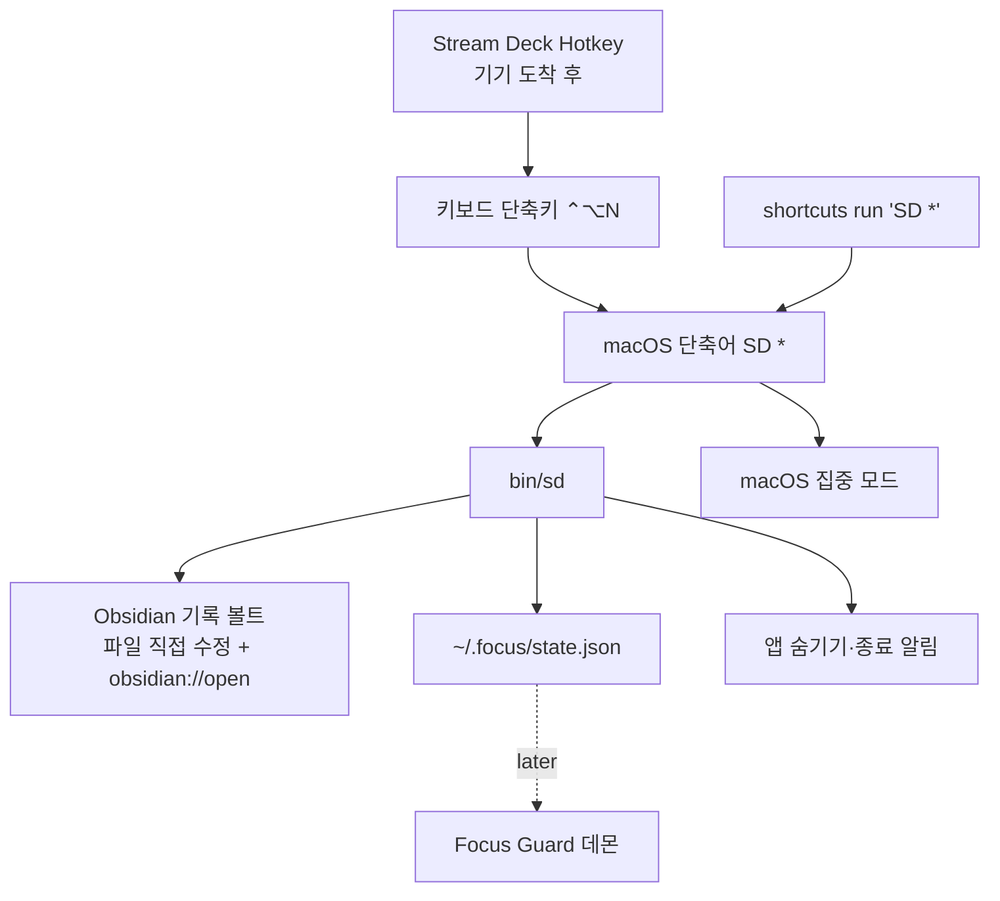

# Architecture

## System Overview

트리거(키보드 단축키, 나중에 Stream Deck Hotkey)는 단축어를 부르기만 한다. 로직은 `bin/sd`에 있고, 단축어는 `bin/sd` 호출과 집중 모드 설정만 한다.



## Tech Stack

| Layer | Choice | ADR |
|-------|--------|-----|
| 동작 | macOS 단축어 (`SD ` 접두어) | — |
| 트리거 | 단축어 키보드 단축키 → 나중에 Stream Deck Hotkey | — |
| 기록 | Obsidian 기록 볼트 (`~/workspace/personal/record-vault`), 코어 Daily Notes·Templates. 플러그인 없음 | — |
| 상태 | `~/.focus/state.json` | — |
| 스크립트 | `bin/sd` (zsh, 단축어 "셸 스크립트 실행"에서 호출) | — |
| Focus Guard (Later) | Python + launchd + osascript, `claude -p --model haiku` | — |
| Testing | `SD_VAULT`·`HOME`을 임시 디렉터리로 두고 `bin/sd` 실행 후 노트·state 확인 | — |

## Directory Structure

```
streaming-deck/
├── bin/sd           # 모든 동작의 진입점 (start-day, deep, shutdown)
├── docs/            # GOAL, ROADMAP, SPEC, ARCHITECTURE, reference/design.md
└── README.md
```

단축어 자체는 macOS에 저장되므로 저장소에는 단축어가 호출하는 스크립트, 볼트 템플릿, 설정 절차만 둔다.

## Import Rules

- 각 단축어는 다른 `SD` 단축어에 의존하지 않는다. 공통 동작(로그 한 줄 추가)이 생기면 스크립트 하나로 뽑는다.
- Focus Guard는 `state.json`만 읽고, 단축어는 `state.json`만 쓴다. 둘 사이의 계약은 이 파일 하나다.

## Key Patterns

- **로그는 파일에 직접 쓴다** (2026-09-26, Advanced URI 대신): `bin/sd`가 `Daily/YYYY-MM-DD.md`의 `## 집중 로그` 섹션 끝에 한 줄을 넣는다. 노트가 없으면 `Templates/Daily.md`로 만든다. 플러그인 의존이 없고, Obsidian이 꺼져 있어도 기록되며, Focus Guard가 같은 경로를 쓸 수 있다. 대가: 노트를 열 때 특정 줄에 커서를 둘 수 없다.
- **집중 모드 on/off는 단축어의 "집중 모드 설정" 액션이 맡는다.** CLI로 제어할 방법이 없기 때문. 단축어는 `bin/sd`가 실패(예: 완료 조건 취소)하면 멈추므로 집중 모드가 켜지지 않는다.

## Constraints

- 트리거 계층에는 로직을 두지 않는다. Stream Deck으로 옮길 때 다시 만들 것이 없어야 한다.
- 브라우저는 Chrome·Safari·Arc 중 하나 (Firefox는 AppleScript로 URL 조회 불가).
- 데몬 환경에 `ANTHROPIC_API_KEY`를 두지 않는다.
