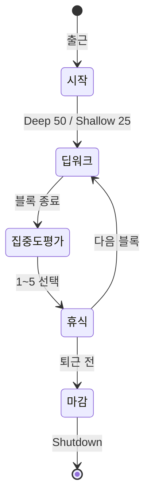
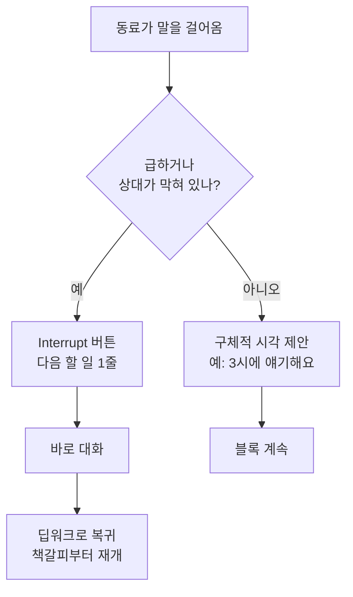
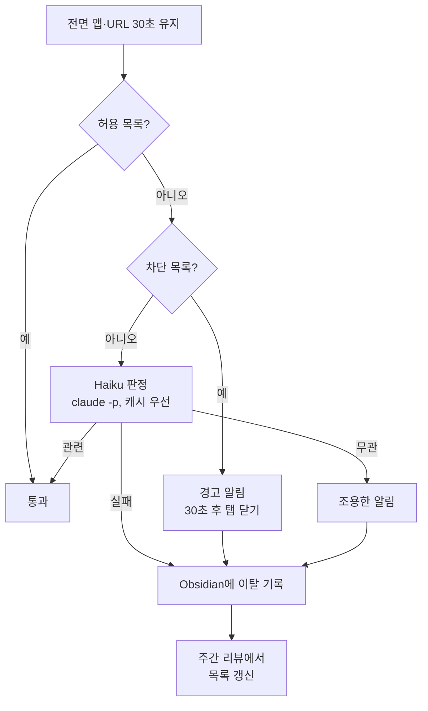

# Stream Deck 업무 시스템 설계문서

2026년 9월 23일 · @wontak ryu

## 1. 개요

Stream Deck을 단축키 모음이 아니라 업무 모드를 바꾸는 "상태 전환 장치"로 쓴다. 목표는 하루 딥 블록 3~4개를 안정적으로 확보하고, 집중과 휴식의 경계를 버튼 하나로 선언하는 것이다.

- **배경**: 2026년 9월 28일 a2sys 입사. agent platform 개발과 agent 연구를 맡을 예정이며, Claude Code, Codex 등 코딩 에이전트를 여러 개 동시에 돌리는 작업 방식이다.
- **철학**: 『피크 퍼포먼스』의 "스트레스 + 휴식 = 성장". 스트레스 관리·밀도 있는 집중, 휴식, 싱글태스킹, 최적화된 루틴, 미니멀리즘, 자아보다 큰 목표의 6원칙을 기능으로 옮긴다.
- **범위**: 개인 업무 관리(집중, 휴식, 기록, 루틴). 팀 협업 도구 자체의 설계는 제외한다.
- **전제**: MacBook Pro 14 (macOS), Stream Deck 15키 모델(3행 × 5열) 가정. 다른 모델이면 버튼 배치만 조정한다.

## 2. 설계 원칙

집중이 무너지는 지점은 대부분 전환 순간이다. 버튼 하나로 모드를 선언하면 환경 전체가 따라 바뀌도록 만든다.

1. **상태 전환 장치**: 하루를 시작 → 딥워크 ⇄ 휴식 → 마감의 모드로 나누고, 각 모드는 전용 페이지를 갖는다.
2. **도구별 역할 분담**: Stream Deck은 조작판, Obsidian 기록 볼트는 기록장이다. 업무 내용은 별도 업무 볼트에 둔다. 할 일은 Tasks, 일정은 Google Calendar, 코드 이력은 git에 맡기고 중복 기록하지 않는다.
3. **사람과 자동화의 경계**: 쓰는 행위 자체가 효과인 것은 사람이, 단순 기록은 기계가 맡는다. 직접 쓰는 시간은 하루 5분 이내다.
4. **적은 버튼**: 페이지당 활성 버튼 8개 이하, 2주간 안 누른 버튼은 삭제한다.

| 피크 퍼포먼스 원칙 | 구현 기능 |
|---|---|
| 스트레스 관리·밀도 있는 집중 | Deep Work 버튼: 방해금지 + 앱 정리 + 타이머 + 시작 로그 |
| 휴식 | 타이머 종료 시 휴식 페이지로 전환, 화면 밖 활동만 배치 |
| 싱글태스킹 | 나의 주의는 작업 1개에만(에이전트는 복수 가능). 블록 시작 시 작업 선언, Focus Guard로 이탈 감지, Interrupt로 책갈피 |
| 최적화된 루틴 | Start Day / Shutdown 멀티액션 |
| 미니멀리즘 | 페이지당 8개 이하, 2주 단위 버튼 정리 |
| 자아보다 큰 목표 | Why 버튼: 분기 목표 노트를 매일 아침 확인 |

### 사람과 자동화의 경계

결정하고, 생각을 머리 밖으로 꺼내고, 돌아보는 일은 사람이 직접 쓴다. 기계가 더 정확하게 관찰하는 사실은 자동으로 남긴다. 데이터는 기계가, 의미는 사람이 만든다.

| 구분 | 항목 | 이유 |
|---|---|---|
| 사람 | 아침 MIT 1개, 오늘 하지 않을 것 | 고르는 과정이 곧 우선순위 판단 |
| 사람 | 블록 시작 시 완료 조건 | 이 블록이 끝나면 무엇이 되어 있나를 정하는 순간 |
| 사람 | Interrupt 시 "다음 할 일" 한 줄 | 작업 기억을 꺼내둠, 나만 앎 |
| 사람 | 집중도 점수 | 멈춰서 돌아보는 습관(메타인지) |
| 사람 | 회고, 내일 첫 작업, 주간 리뷰 답변 | 생각 정리 그 자체 |
| 사람 | Why·분기 목표, 5분 허용 선택 | 의도적인 선택이 핵심 |
| 자동 | 시각, 블록 시작·종료, 중단 시점 | 기계가 더 정확 |
| 자동 | 집중 모드, Slack 상태, 앱 배치, 노트 생성 | 반복 작업, 판단 불필요 |
| 자동 | 이탈 감지·기록, 블록 수·평균 집중도·이탈 횟수 집계 | 관찰과 계산 |
| 제안 후 사람 확정 | 회색지대 목록 추가안, MIT 후보 | 기계가 후보를 모으고 선택은 사람이 |

지키는 선:

- 집중도 점수를 Focus Guard 데이터로 자동 계산하지 않는다. 자동 데이터는 주간 리뷰에서 체감과 비교하는 거울로만 쓴다.
- 회고와 주간 리뷰 답변을 AI가 쓰게 하지 않는다. 주간 리뷰 노트의 집계 숫자만 자동으로 채우고, 질문에 대한 답은 직접 쓴다.
- 손으로 쓰는 시간이 하루 5분을 넘으면 생각하는 부분을 자동화하지 말고 쓰는 항목을 줄인다.

## 3. 시스템 구성

모든 버튼은 세 가지 연동 방식 중 하나로 동작한다: URL 호출, macOS 단축어(Shortcuts), 키보드 단축키. 여러 동작은 Stream Deck의 Multi Action으로 묶는다.

| 구성 요소 | 역할 | 연동 방식 |
|---|---|---|
| Stream Deck | 모드 전환, 기록 트리거 | Multi Action, Website(Open URL), Hotkey, 페이지 이동 |
| Obsidian + Advanced URI 플러그인 | 기록 볼트: 데일리 노트, 집중 로그, 회고 | `obsidian://advanced-uri?...` URL로 노트 열기·텍스트 추가 |
| Obsidian Daily Notes/Templater | 데일리 노트 자동 생성 | 템플릿 지정 |
| macOS 단축어 | 집중 모드 on/off, 앱 숨기기, Slack 상태 변경 | Stream Deck에서 단축어 실행 |
| iTerm2 | 개발 환경, 에이전트 실행 | 저장된 Arrangement 복원, Triggers로 완료 알림 |
| Google Calendar | 일정, 딥 블록 예약 | 오늘 보기 URL |
| Tasks | 할 일 목록 | 웹 URL 또는 앱 열기 |
| 포모도로 플러그인 | 블록 타이머, 남은 시간 표시 | Stream Deck 마켓플레이스 |
| ActivityWatch | 앱 사용 시간 자동 추적 | 백그라운드 실행 |

Slack 상태 변경은 단축어에서 Slack API(`users.profile.set`)를 호출하는 방식이다. 회사 워크스페이스에서 개인 토큰 발급이 가능한지 입사 후 확인이 필요하다.

## 4. 페이지 구조와 버튼 배치

하나의 프로필 안에 페이지 4개(시작, 딥워크, 휴식, 마감)와 폴더 1개(집중도 평가)를 둔다. 모든 페이지의 마지막 행은 동일한 탐색 행이다.



딥워크에서 휴식으로 가는 길은 항상 집중도 평가를 거친다. 평가를 건너뛸 수 없게 만드는 것이 기록이 쌓이는 핵심이다.

**시작 페이지**

| | 1 | 2 | 3 | 4 | 5 |
|---|---|---|---|---|---|
| 1행 | Start Day | Why | 오늘 일정 | Tasks | 개발 환경 |
| 2행 | 데일리 노트 | | | | |
| 3행 | [시작] | [딥워크] | [휴식] | [마감] | |

**딥워크 페이지**

| | 1 | 2 | 3 | 4 | 5 |
|---|---|---|---|---|---|
| 1행 | Deep 50 | Shallow 25 | 타이머(남은 시간) | Interrupt | 인박스 메모 |
| 2행 | 블록 종료 | 에이전트 상태 | 5분 허용 | | |
| 3행 | [시작] | [딥워크] | [휴식] | [마감] | |

**집중도 평가 폴더**

| | 1 | 2 | 3 | 4 | 5 |
|---|---|---|---|---|---|
| 1행 | 1 산만 | 2 | 3 보통 | 4 | 5 몰입 |

**휴식 페이지**

| | 1 | 2 | 3 | 4 | 5 |
|---|---|---|---|---|---|
| 1행 | 호흡 3분 | 산책 10분 | 물·스트레칭 | 다음 블록 | |
| 3행 | [시작] | [딥워크] | [휴식] | [마감] | |

**마감 페이지**

| | 1 | 2 | 3 | 4 | 5 |
|---|---|---|---|---|---|
| 1행 | Shutdown | 주간 리뷰 | | | |
| 3행 | [시작] | [딥워크] | [휴식] | [마감] | |

### 버튼 동작 명세

| 버튼 | 동작 순서 |
|---|---|
| Start Day | 데일리 노트 생성·열기 → Calendar 오늘 보기 → Tasks 열기 → 노트의 MIT 칸에 커서 |
| Why | 분기 목표 노트(`Goals/2026-Q4.md`) 열기 |
| 개발 환경 | iTerm2 작업 Arrangement 복원 |
| Deep 50 | 단축어: 완료 조건 입력창(기본값은 MIT 또는 직전 '다음 할 일', 빈칸이면 중단) → 집중 모드 on, Slack·메일 숨기기, Slack 상태 "집중 중 ~HH:MM" → 집중 로그에 `HH:MM 시작 — ` 추가 → 상태 파일에 모드·완료 조건 기록(Focus Guard 켜짐) → 50분 타이머 |
| Shallow 25 | Deep 50과 동일, 단 집중 모드는 켜지 않고 25분 타이머 |
| Interrupt | 타이머 일시정지 → `HH:MM 중단 — 다음: ` 추가 후 커서 대기 |
| 인박스 메모 | `Inbox.md`에 한 줄 추가(떠오른 잡생각을 치우는 용도) |
| 블록 종료 | 타이머 정지 → 집중도 평가 폴더 열기 |
| 집중도 1~5 | `HH:MM 집중도 N` 추가 → 집중 모드 off → 휴식 페이지 |
| 에이전트 상태 | iTerm2 에이전트 탭으로 전환(블록 사이에만 사용) |
| 호흡 3분 / 산책 10분 | 해당 시간 타이머 |
| 다음 블록 | 딥워크 페이지로 이동 |
| Shutdown | 데일리 노트 회고 섹션 열기 → 집중 모드·Slack 상태 해제 → iTerm2·업무 앱 종료 |
| 주간 리뷰 | 주간 리뷰 노트 생성·열기(금요일) |
| 5분 허용 | Focus Guard 예외 5분 → 집중 로그에 override 기록 |

## 5. 핵심 워크플로

### 하루 흐름

딥 블록은 오전에 몰고, 얇은 블록과 협업은 오후에 둔다. 시각은 출근 9시 기준 예시이며 팀 리듬을 본 뒤 조정한다.

| 시간 | 모드 | 내용 |
|---|---|---|
| 09:00 | 시작 | Start Day, Why 확인, MIT 1개 적기 (10분) |
| 09:15 | 딥 블록 1 | MIT 작업 (50분 + 휴식 10분) |
| 10:15 | 딥 블록 2 | MIT 계속 또는 두 번째 중요 작업 |
| 11:15 | 얇은 블록 | Slack·메일·리뷰 몰아 처리 (25분) |
| 13:00 | 열린 시간 | 동료 질문·미팅 우선 |
| 14:30 | 딥 블록 3 | 연구·설계 또는 구현 |
| 16:00 | 얇은 블록 | 정리, 문서, 에이전트 결과 검토 |
| 17:45 | 마감 | Shutdown, 회고, 내일 첫 작업 1개 |

딥 블록은 Google Calendar에 미리 예약해서 미팅이 침범하지 않게 한다. 하루 딥 블록 3~4개가 상한이며, 그 이상은 목표로 잡지 않는다.

### 블록 규칙

- Deep 50: 설계, 연구, 코드 작성. 50분 집중 + 10분 휴식.
- Shallow 25: 메일, 리뷰, 문서 정리. 25분 + 5분.
- 블록 시작 시 입력창에 완료 조건 1개를 쓴다(예: "캐시 전략 2안 비교표 완성"). 주제가 아니라 끝났는지 판단할 수 있는 문장으로 쓰고, 빈칸이면 블록이 시작되지 않는다. 블록 중간에 작업이 바뀌면 블록을 끝내고 새로 선언한다.
- 휴식은 화면 밖에서 한다. Slack·뉴스 확인은 휴식이 아니라 얇은 블록이다.

### 인터럽트 처리

동료가 말을 걸면 3초 안에 판단한다.



미룰 때도 고개를 들고 눈을 맞춘다. 막연한 "나중에" 대신 시각을 주면 거절이 아니라 약속이 된다. 입사 초반에는 열린 시간을 넓게 잡고, 팀 소통 방식을 파악한 뒤 집중 시간 규범을 제안한다.

### 에이전트 운영 규칙

- 싱글태스킹은 나의 주의에 대한 규칙이다. 같은 목표를 위해 에이전트 여러 개를 병렬로 돌리는 것은 허용한다.
- 에이전트에게 맡길 일은 블록 시작 전에 배분하고, 블록 중에는 내 주 작업 1개만 본다.
- 완료는 iTerm2 Triggers 알림으로 받고, 터미널을 반복해서 확인하지 않는다.
- 에이전트 결과 검토는 블록 사이 또는 얇은 블록에서 한다. 대기 시간에 새 일을 시작하지 않는다.

## 6. Obsidian 데일리 노트

Obsidian은 볼트 2개로 나눈다. 기록 볼트에는 데일리 노트·집중 로그·회고·목표만 두고, 연구·설계 등 업무 내용은 업무 볼트에 둔다. Stream Deck과 Focus Guard는 기록 볼트에만 쓴다.

| 볼트 | 용도 | 구성 |
|---|---|---|
| 기록 볼트 | 데일리 노트, 집중·이탈 로그, 회고, 목표 | `Daily/`, `Weekly/`, `Goals/`, `Inbox.md`, `Templates/` |
| 업무 볼트 | 연구·설계 노트, 회의록 등 업무 내용 | 별도 설계 |

- Stream Deck의 Advanced URI 호출에는 모두 `vault=` 파라미터로 기록 볼트를 명시한다. 업무 볼트가 열려 있어도 로그가 엉뚱한 곳에 쌓이지 않게 하기 위함이다.
- 볼트 간에는 위키링크가 동작하지 않는다. 데일리 노트에서 업무 노트를 가리킬 때는 `obsidian://open?vault=...&file=...` 링크를 쓴다.
- 업무 내용은 기록 볼트로 복사하지 않고 링크만 남긴다. 작업명은 짧게 쓴다.

### 데일리 노트 템플릿

```markdown
# {{date:YYYY-MM-DD ddd}}

## MIT
- 

## 오늘 하지 않을 것
- 

## 집중 로그

## 회고
- 잘된 것:
- 개선할 것:
- 내일 첫 작업:
```

### 자동 기록 포맷

버튼은 Advanced URI로 `## 집중 로그` 헤딩 아래에 한 줄씩 추가한다. 형식을 고정해 두면 나중에 Dataview나 스크립트로 집계할 수 있다.

| 이벤트 | 형식 | 예시 |
|---|---|---|
| 블록 시작 | `- HH:MM start [deep\|shallow] — 작업명` | `- 09:15 start deep — 메모리 모듈 설계` |
| 중단 | `- HH:MM interrupt — 다음: 내용` | `- 10:40 interrupt — 다음: 캐시 전략 비교` |
| 집중도 | `- HH:MM focus N` | `- 10:05 focus 4` |

시각은 Advanced URI의 날짜 변수를 쓰거나, 단축어에서 현재 시각을 넣은 URL을 만들어 호출한다. 완료 조건은 블록 시작 입력창에서 받아 자동으로 들어가고, 다음 할 일처럼 손으로 쓸 부분만 줄 끝에 커서를 두고 타이핑한다.

## 7. 집중도 측정과 주간 리뷰

집중은 자기 평가, 자동 추적, 주간 리뷰의 세 층으로 확인한다. 둘을 비교하는 것이 가장 정직한 피드백이다.

| 층 | 방법 | 주기 |
|---|---|---|
| 자기 평가 | 블록 종료 시 집중도 1~5 버튼 | 매 블록 |
| 자동 추적 | ActivityWatch로 앱·창별 사용 시간 기록 | 상시 |
| 주간 리뷰 | 집중 로그와 ActivityWatch 비교, 루틴 1개 조정 | 매주 금요일 30분 |

집중도 기준:

- 5 몰입: 시간 감각이 사라짐, 다른 앱을 열지 않음
- 3 보통: 작업은 진행됐지만 두세 번 새나감
- 1 산만: 블록 대부분을 다른 일에 씀

주간 리뷰 질문:

1. 이번 주 딥 블록은 몇 개였고, 평균 집중도는?
2. 집중도가 높았던 시간대와 작업 종류는? 완료 조건이 두루뭉술한 블록은 집중도가 낮았나?
3. 중단은 몇 번이었고, 주로 어디서 왔나?
4. MIT를 끝낸 날은 몇 일인가?
5. 다음 주에 바꿀 루틴 1개는? (블록 길이, 시간대, 버튼 정리 등)
6. 이번 주 일은 분기 목표에 어떻게 기여했나?

## 8. Focus Guard (이탈 감시)

딥워크 블록 동안 Mac의 전면 앱·창 제목·브라우저 URL을 보고, 선언한 작업과 무관한 활동이 이어지면 알림을 주고, 확실한 경우에만 경고 후 탭을 닫는다. 감시 대상은 나의 주의이며, 에이전트 수는 제한하지 않는다.

### 동작 조건

- Deep 50 버튼이 상태 파일(`~/.focus/state.json`)에 `mode: deep`, 입력한 완료 조건, 종료 시각을 기록하면 활성화된다. 완료 조건은 Haiku 판정의 기준이 된다.
- Shallow 25는 알림만, 휴식·마감 모드에서는 꺼진다.
- 한 화면에 30초 이상 머물 때만 판단한다. 잠깐 찾아보는 검색은 이탈로 보지 않는다.

### 판단 흐름



자동 종료는 차단 목록에만 적용하고, LLM 판정은 알림까지만 쓴다. 회색지대 도메인은 주간 리뷰에서 허용 또는 차단 목록으로 옮기며, 몇 주가 지나면 회색지대가 거의 남지 않는다.

### 단계별 대응

| 단계 | 조건 | 대응 |
|---|---|---|
| 통과 | 허용 목록 | 없음 |
| 기록 | 회색지대 30초 유지 | Haiku가 무관으로 판정하면 조용한 알림 "지금 Deep 블록: {작업명}", 판정 실패 시 로그만 |
| 경고 | 차단 목록 30초 유지 | 알림 + 소리, "30초 후 닫습니다" |
| 종료 | 경고 후 30초 내 이탈 지속, 예외 미승인 | 해당 탭만 닫기(브라우저 전체 아님), 앱은 숨기기 |

터미널, IDE, Obsidian 등 작업 중인 앱은 어떤 경우에도 종료하지 않는다. 데이터 손실 위험이 있기 때문이다.

### 목록 예시

| 구분 | 대상 |
|---|---|
| 허용 | iTerm2, IDE, Obsidian, github.com, arxiv.org, 사내 문서, 기술 문서 사이트 |
| 차단 | youtube.com, SNS, 커뮤니티·뉴스 포털, 쇼핑 |
| 회색지대(로그 후 주간 분류) | 그 외 전부 |

YouTube는 컨퍼런스 발표처럼 업무인 경우가 있다. 이때는 Stream Deck의 "5분 허용" 버튼으로 예외를 선언하고, 예외 사용도 로그에 남긴다.

### 구현 방식

- **수집**: osascript로 전면 앱과 브라우저 활성 탭 URL·제목을 5초마다 조회.
- **분류**: 도메인·앱 이름 목록 매칭이 1차, 회색지대만 Claude Code 헤드리스로 Haiku가 판정한다. Claude API는 쓰지 않는다. 데몬 자체는 Claude Code로 작성한다.
- **실행**: Python 데몬을 launchd로 상시 실행, 상태 파일이 deep일 때만 판단. 알림과 탭 닫기도 osascript로 처리한다.
- **기록**: Obsidian 집중 로그에 `- HH:MM distraction youtube.com (closed)`, `- HH:MM override 5m` 형식으로 추가한다.

### 판단 신호와 권한

Focus Guard는 Apple 스크린 타임을 쓰지 않고, 5초마다 macOS에 직접 조회한 네 가지 신호로 판단한다. 스크린 타임은 하루 단위 통계용이라 실시간으로 읽기 어렵다.

| 신호 | 수집 방법 | 용도 |
|---|---|---|
| 전면 앱 | osascript로 System Events 조회 | 허용·차단 앱 판별 |
| 브라우저 활성 탭 URL·제목 | Chrome·Safari·Arc의 AppleScript | 도메인 목록 매칭, Haiku 입력 |
| 유휴 시간 | 키보드·마우스 마지막 입력 이후 경과 시간 | 자리 비운 동안은 이탈로 세지 않음 |
| 현재 모드·작업명 | Stream Deck이 쓴 `~/.focus/state.json` | 딥워크 중에만 판단, 작업명을 Haiku에 전달 |

- 처음 실행 시 macOS의 손쉬운 사용과 자동화(브라우저 제어) 권한을 허용해야 한다.
- Firefox는 AppleScript로 URL을 얻기 어려워, 업무 브라우저는 Chrome·Safari·Arc 중 하나로 한다.
- ActivityWatch는 주간 리뷰용 기록에 쓰고, 실시간 판단은 지연이 적은 직접 조회를 기본으로 한다.

### LLM 분류 (Claude Code 헤드리스)

회색지대 판정은 API 키 없이 `claude -p --model haiku`로 처리해 구독 사용량 안에서 돌린다. 새 도메인에만 호출하므로 하루 수십 회 이하이고, 코딩 사용량에 비하면 미미하다.

| 항목 | 설계 |
|---|---|
| 모델 | 실시간 판정은 Haiku. Sonnet은 주간 리뷰 배치에만 사용(회색지대 로그를 보고 목록 추가안 제안) |
| 호출 방식 | 프로젝트 파일이 없는 빈 디렉터리에서 도구 없이 1턴, `--output-format json` |
| 입력 | 선언한 작업명, 도메인, 탭 제목만. 페이지 본문은 보내지 않음 |
| 출력 | `{"related": true/false, "confidence": 0~1}` |
| 캐시 | 도메인 + 작업명 단위로 저장, 같은 블록에서 재호출 없음 |
| 실패 처리 | 사용량 한도·타임아웃이면 판정 없이 로그만(fail-open) |

주의 사항:

- 환경 변수에 `ANTHROPIC_API_KEY`가 있으면 API로 과금된다. 데몬 환경에서 제거하고, 첫 주에 claude.ai 사용량 화면에 잡히는지 확인한다.
- 헤드리스 사용량을 별도 크레딧으로 분리하는 변경이 2026년 6월에 예고됐다가 보류된 상태다. 정책이 바뀌면 LLM 층만 끄고 목록 매칭으로 돌아갈 수 있게 선택 모듈로 둔다.
- 코딩 에이전트와 같은 사용량 한도를 공유하므로, 한도에 가까워지면 분류부터 멈춘다.
- 회사 계정(Team 등)으로 로그인한다면 개인 용도 자동화에 쓰는 것이 괜찮은지 확인한다.

### 도입 원칙

첫 주는 알림 전용 모드로만 돌려 오탐을 세고, 차단 목록 오탐이 거의 없을 때 종료 기능을 켠다. 목적은 벌주가 아니라 알아차림이며, 주간 리뷰에서 이탈 횟수를 함께 본다.

### 스마트폰 (Galaxy S26 Ultra)

스마트폰은 연동하지 않고 물리적으로 분리한다. Mac과의 실시간 동기화는 개발량 대비 효과가 작아 범위에서 제외한다.

- 딥 블록 동안 휴대폰은 책상 밖(가방, 다른 자리)에 둔다.
- 보완: 모드 및 루틴의 "업무" 모드로 평일 딥 블록 시간대 또는 회사 Wi-Fi 연결 시 방해금지. 예외는 즐겨찾기 연락처와 반복 발신.
- 휴식 블록에서도 휴대폰은 집지 않는다. 확인은 얇은 블록에서 한다.

## 9. 도입 로드맵

처음부터 다 만들지 않는다. 버튼 4개로 시작해 기록을 보고 늘리거나 줄인다.

| 시기 | 범위 | 완료 기준 |
|---|---|---|
| 입사 전 (~9/27) | Obsidian 기록 볼트 생성·템플릿, Advanced URI 설치, 집중 모드 단축어 | Start Day 버튼으로 데일리 노트가 열림 |
| 1주차 (9/28~) | Start Day, Deep 50, 타이머, Shutdown | 매일 시작·마감 의식 실행 |
| 2주차 | 집중도 폴더, 휴식 페이지, Interrupt, 인박스 | 블록마다 집중도 기록 |
| 3주차 | ActivityWatch, Slack 상태 연동, 에이전트 알림, Focus Guard(알림 전용) | 첫 주간 리뷰 완료 |
| 4주차 | 블록 길이·시간대 조정, 안 쓴 버튼 삭제, Focus Guard 탭 닫기 켜기 | 버튼 구성 v2 확정 |

성공 지표 (4주차 기준):

- 하루 딥 블록 평균 3개 이상
- 블록 평균 집중도 3.5 이상
- MIT 완료율 주 4일 이상
- Shutdown 실행률 주 5일

미결 사항:

- [x] Stream Deck 모델 확인 → MK.2 (15키, 3×5, 다이얼 없음). 배치 조정 불필요
- [ ] "Tasks"가 Google Tasks인지 Obsidian Tasks 플러그인인지 확정
- [ ] 회사 Slack에서 개인 API 토큰 발급 가능 여부
- [ ] 팀 출퇴근·미팅 리듬 파악 후 하루 흐름 시간표 조정
- [ ] 분기 목표(Why) 노트 작성 — a2sys에서 이루고 싶은 것

## 10. Stream Deck 없이 미리 세팅하기

모든 동작을 macOS 단축어에 넣어 두고 Stream Deck은 그 단축어를 누르는 스위치로만 쓴다. 이렇게 하면 기기가 없어도 오늘 전부 만들고 테스트할 수 있고, 기기가 오면 버튼에 연결만 하면 된다.

| 계층 | 담당 | 기기 없이 가능 |
|---|---|---|
| 기록 | Obsidian 기록 볼트, 템플릿, Advanced URI | 예 |
| 동작 | macOS 단축어 (`SD ` 접두어로 이름 통일) | 예 |
| 트리거 | 지금은 키보드 단축키, 나중에 Stream Deck 버튼 | 임시 대체 |
| 표시 | 타이머 남은 시간, 페이지 전환 | 아니오 (기기 도착 후) |

순서:

1. 기록 볼트·템플릿·Advanced URI를 만들고, URL을 터미널에서 `open "obsidian://advanced-uri?vault=..."`로 호출해 로그 줄이 제자리에 붙는지 확인한다.
2. 버튼마다 단축어를 하나씩 만든다: `SD Start Day`, `SD Deep 50`, `SD Shallow 25`, `SD Interrupt`, `SD Focus 1`~`SD Focus 5`, `SD Shutdown`. 여러 동작은 Multi Action이 아니라 단축어 안에서 순서대로 묶는다.
3. 각 단축어에 임시 키보드 단축키를 지정한다(단축어 정보 → 키보드 단축키 추가). 예: ⌃⌥1 Start Day, ⌃⌥2 Deep 50, ⌃⌥0 Shutdown.
4. 터미널에서 `shortcuts run "SD Deep 50"`으로도 돌려 본다. Focus Guard 데몬이나 스크립트가 같은 단축어를 부를 수 있다.
5. 타이머는 당분간 단축어가 종료 시각을 `~/.focus/state.json`에 쓰고 알림으로 대신한다. 남은 시간 표시는 기기 도착 후 포모도로 플러그인으로 옮긴다.
6. 1주차는 키보드 단축키로 실제 업무에 써 보고, 안 누르게 되는 동작은 이때 뺀다.

기기가 도착하면:

- 각 버튼에 Hotkey 액션으로 같은 키보드 단축키를 연결한다. 플러그인 없이 바로 동작하고, 로직을 다시 만들 필요가 없다.
- 페이지 이동, 집중도 폴더, 타이머 표시만 Stream Deck 앱에서 새로 구성한다.

임시 버튼이 꼭 필요하면:

- Stream Deck Mobile 무료판은 버튼 6개까지 쓸 수 있어 1주차 버튼 4개가 들어간다. 단 딥 블록 중 휴대폰을 치운다는 원칙과 충돌하므로 권하지 않는다.
- Virtual Stream Deck(Mac 화면용 가상 패널)은 실물 기기를 연결한 적이 있거나 Mobile Pro 구독이 있어야 켜진다.
